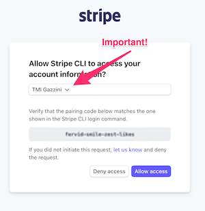

This is an example checkout page hacked together for the True Medicine tech interview!

There are 2 components to run locally:
* The next.js web app
* The local Stripe server

## Getting Started

### Running the web app
Make sure you're in the root directory (the same one as this `README.md` file), and run the following 2 commands:
```
npm i
npm run dev
```

Then, navigate to [localhost:3000](http://localhost:3000) in your favorite web browser (which is Google Chrome).

### Running the Stripe server
Do you have the Stripe server installed? Try typing this into your terminal window:
`which stripe`

If this returns the message "stripe not found", then install it by running this command:
`brew install stripe/stripe-cli/stripe`

Make sure you login to the "TMI Gazzini" Stripe account locally by running the following:
\
`stripe login`

Press `<Enter>` and make sure to select TMI Gazzini in the web browser:
\



## Compromises
* Security (src/lib/keys.tsx)
* Objects have to be hard-coded in the app & also present in the Stripe account

